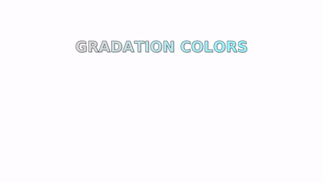

	# CLARAFX (WIP)


## Examples

_Example file [mysubfx.lisp](Examples/mysubfx.lisp)_

SBCL

```sh
$ sbcl --load Examples/mysubfx.lisp --eval '(sb-ext:quit)'
```


_Example file [mysubfx2.lisp](Examples/mysubfx2.lisp)_

SBCL

```sh
$ sbcl --load Examples/mysubfx2.lisp --eval '(sb-ext:quit)'
```


## Use effects from subtitle file

Subtitle file should already have correct karaoke time before using effects.

Make effects from existing file with 3 step:

1. Add effects to script info

```txt
[Script Info]
...
clarafx-1: shaking,default,62,5
clarafx-2: dropping,default,62,7
...
```

2. Choose dialogues matching with effects

```txt
[Events]
...
Dialogue: 1st,2nd,3rd,4th,5th,6th,7th,8th,clarafx-1,10th
Dialogue: 1st,2nd,3rd,4th,5th,6th,7th,8th,clarafx-1,10th
Dialogue: 1st,2nd,3rd,4th,5th,6th,7th,8th,clarafx-2,10th
Dialogue: 1st,2nd,3rd,4th,5th,6th,7th,8th,clarafx-1,10th
Dialogue: 1st,2nd,3rd,4th,5th,6th,7th,8th,,10th
...
```

3. Write modified subtitle to different file

```sh
$ sbcl --eval '(require :asdf)' \
       --eval '(asdf:load-system "clarafx")' \
       --eval '(clarafx:write-subtitle-effect #p"source.ass" #p"output.ass")' \
       --eval '(sb-ext:quit)'
```

## Write your own effect

```lisp

(define-effect (my-own-effect var)
  (modifier ...)
  (modifier ...)
  ...)

(register-effect "my-own-effect" 'my-own-effect)

```

_Example file [mysubfx3.lisp](Examples/mysubfx3.lisp)_


## Drawing Commands

1. Drawing commands string from function

```lisp

(make-shape-five-star)

```

2. Drawing commands from character

```lisp

(char-to-drawing-commands #\&)

(char-to-drawing-commands #\⻰ :face (make-face* "WenQuanYi Zen Hei"))

```

3. Drawing commands from SVG path

```lisp

(svg-path-to-drawing-commands #p"/tmp/path.svg")

```

## Vertical Alignment

Add more options for alignment numpad with vertical alignment.

_Example file [mysubfx4.lisp](Examples/mysubfx4.lisp)_


## Partial Effect

Create partial effect from dialogue with same position and karaoke time.

_Example file [mysubfx5.lisp](Examples/mysubfx5.lisp)_


## Gradation

Color gradation from primary to secondary colors or vise versa.

_Example file [mysubfx6.lisp](Examples/mysubfx6.lisp)_



## CLI

Write effects from file that already have clarafx information.

```sh
$ clarafx -i input.ass -o output.ass
```

Load clarafx script from a file.

```sh
$ clarafx script.lisp
```

Load clarafx script from a file with external effects.

```sh
$ clarafx -l script.lisp
```

Help message:

```sh
Usage: clarafx [-h] [-v] [-s] [-l] [-i <file>] [-o <file>] [<script>.lisp]

Available options:
  -h        Show this help message.
  -v        Show version.
  -s        Supersede output if it already exists.
  -l        Load external effects. [From: $PWD/clarafx.lisp | $HOME/.config/clarafx/clarafx.lisp]
  -i <file> Input file.ass which has effects information.
  -o <file> Output file.ass for final subtitle effects according to input. [Default: stdout]
```

# Tests

```txt

Running test suite INTERN-SUITE
 Running test STRIP-PACKAGE-FROM-SYMBOL ................
 Running test SPLIT-ELEMENT-DRAWING-COMMANDS ....
 Running test SVG-DATA-TO-ELEMENT-DRAWING-COMMANDS ....
 Did 24 checks.
    Pass: 24 (100%)
    Skip: 0 ( 0%)
    Fail: 0 ( 0%)


Running test suite EXTERN-SUITE
 Running test PARSE-EFFECT ..
 Running test PARSE-DRAWING-COMMANDS ...
 Running test RESIZE-DRAWING-COMMANDS ........
 Running test MOVING-DRAWING-COMMANDS ........
 Running test NEGATE-DRAWING-COMMANDS ...
 Running test ROUND-DRAWING-COMMANDS ...
 Running test MINMAX-DRAWING-COMMANDS .........
 Running test ROTATE-DRAWING-COMMANDS ......
 Did 42 checks.
    Pass: 42 (100%)
    Skip: 0 ( 0%)
    Fail: 0 ( 0%)


Running test suite DIALOGUE-SUITE
 Running test POPULATE-ZERO-KARAOKE ....
 Running test POPULATE-DELAY-EFFECT .........
 Running test POPULATE-ODD-EVEN-EFFECT ............
 Running test PARTIAL-EFFECTS ........
 Did 33 checks.
    Pass: 33 (100%)
    Skip: 0 ( 0%)
    Fail: 0 ( 0%)

```

# License

[BSD 2-Clause License](LICENSE)

